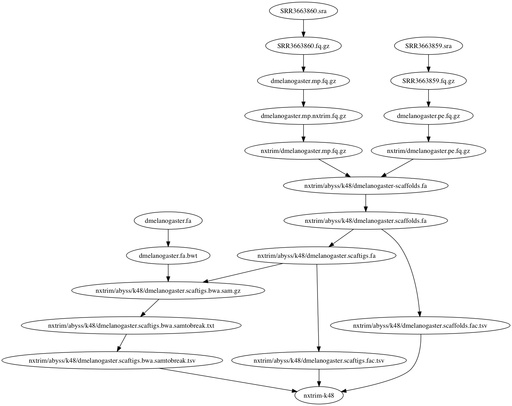

# Assemble *Drosophila melanogaster* with ABySS

I assembled an Illumina short-read sequencing data set of *Drosophila melanogaster* with ABySS 2.0.1. The data set includes a 2x101 paired-end library and a 2x110 mate-pair library. I assembled the reads with and without adapter trimming the mate-pair library using [NxTrim (doi:10.1101/007666)](https://github.com/sequencing/NxTrim), and compared the results of these two methods. I optimized *k* and *N* and selected the best assembly (see Methods). I aligned the assembled scaftigs to the reference (BDGP6) using [BWA-MEM](https://github.com/lh3/bwa) and calculated assembly metrics using `abyss-samtobreak` and `abyss-fac`. I find that the assembly of mate-pair reads trimmed with NxTrim yields an assembly that is both more contiguous (scaffold NGA50) and more correct (fewer breakpoints compared to the reference).

# Data

* Paired-end: <https://trace.ncbi.nlm.nih.gov/Traces/sra/?run=SRR3663859>
* Mate-pair: <https://trace.ncbi.nlm.nih.gov/Traces/sra/?run=SRR3663860>

# Results

+ [Report of assembly metrics](http://sjackman.ca/abyss-drosophila-melanogaster/dmelanogaster.samtobreak.nb.html) using RMarkdown
+ Assembly metrics of `abyss-samtobreak`: [dmelanogaster.samtobreak.tsv](dmelanogaster.samtobreak.tsv)
+ Assembly metrics of `abyss-abyss-fac`: [dmelanogaster.abyss-fac.tsv](dmelanogaster.abyss-fac.tsv)

# Methods

I optimized *k* by trying every value between 32 and 64 with a step size of 8 and selected the assembly with the best NGA50.
I optimized *N* by trying every value between 10 and 25 and selecting the assembly with the best N50.

```sh
cd nxtrim/abyss/k48
for n in 5 {10..25}; do
	echo n=$n
	abyss-scaffold -k48 -G143725995 -s1000-10000 -n$n dmelanogaster-6.dot mp1-6.dist.dot 2>&1 >/dev/null | tail -n1
done
```

# Pipeline

[](Makefile.pdf)
